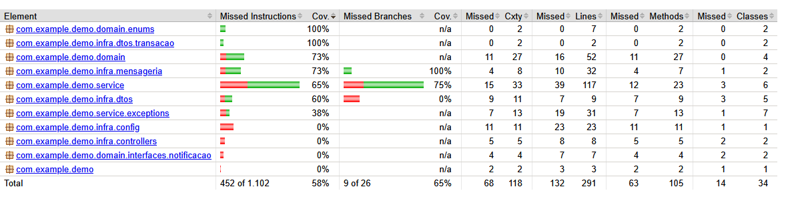
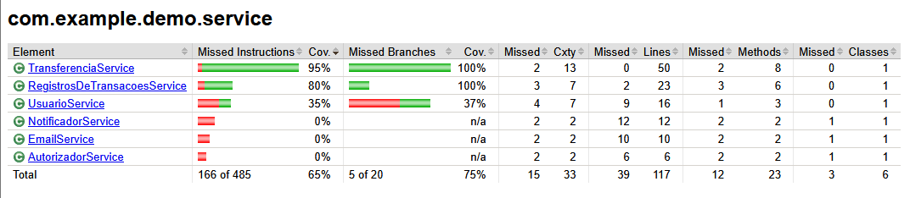

# 🪙 Desafio de Sistema de Pagamentos 💱


Aplicação baseada no desafio backend do [PicPay](https://github.com/PicPay/picpay-desafio-backend).  

Implementa funcionalidades de 
- Cadastro de usuários 
- Transferência de valores
- Auditoria de transações e 
- Notificações

---

## 📒 Resumo das Funcionalidades

### 1. Cadastro de Usuários
- Nome completo, CPF, e-mail e senha obrigatórios.  
- CPF/CNPJ e e-mail devem ser únicos no sistema.  
- `UserEntity` como classe abstrata, com heranças:  
  - **UsuarioComum**  
  - **Lojista**

### 2. Regras de Transferência
- Usuários podem enviar dinheiro para outros usuários e lojistas.  
- Lojistas apenas recebem, não podem enviar.  
- Antes da transferência:  
  - Verificar saldo do pagador.  
  - Consultar **serviço autorizador externo** (mock GET).  
- Transferência é **transacional** (revertida em caso de falha).  

- Exemplo de endpoint:

```http request
POST /transfer
Content-Type: application/json

{
  "value": 100.0,
  "payer": 4,
  "payee": 15
}
```

### 3. Notificação
- Ao receber pagamento, o usuário/lojista deve ser notificado (e-mail ou SMS). 

- Feito por serviço externo (mock POST), que pode estar **instável**.

- Uso de **RabbitMQ** para guardar notificações que falharam e reprocessá-las.


## 🩻 Design e Arquitetura
- Aplicação dos princípios SOLID
- Abstração de usuários: ``UserEntity`` é abstrata, com ``UsuarioComum`` e ``Lojista`` como implementações.
    - Facilita a criação de regras específicas futuramente. 
- **Uso de Interfaces:** Comportamentos são definidos por contratos claros.
- **Padrão de Design:** Strategy para lidar com as diferentes lógicas de notificação:

    - Por e-mail: usando SMTP

    - Por SMS: (não implementado)


## 🪄 Tecnologias Utilizadas

- **Java + Spring Boot**

- **Postgres**: 
    - Armazena dados de usuários.
    - Uso de ``DiscriminatorValue`` para diferenciar ``UsuarioComum`` e ``Lojista``.

- **MongoDB:** 
    - Armazena transações para auditoria (eventos imutáveis).
    - Exemplo de documento:
    
    ```java
    @Document(collection = "transacoes")
    public class TransacaoDocument {
        @Id
        private String id;
        private Long idPayer;
        private Long idPayee;
        private BigDecimal valor;
        private TransacaoDTOResponse status;
        private LocalDate timestamp;
        private boolean autorizado;
        private boolean notificacaoEnviada;
    }
- **RabbitMQ:** 
    - Utilizado para mensageria de notificações.
    - Notificações que falham são enfileiradas e reprocessadas quando o serviço externo volta.

- **Docker:**
    - Containerização dos serviços (**Postgres**, **MongoDB** e **RabbitMQ**).


## ⚠️ Tratamento de Erros

- Exceções personalizadas para cada regra de negócio:
    - ``UsuarioNaoEncontradoException``
    - ``TransacaoNaoAutorizadaException``
    - ``LojistaNaoPodeEnviarDinheiroException``
    - entre outras


## ⚗️Testes

- **Testes unitários** utilizando JUnit e Mockito.
- **Cobertura de código** medida com JaCoCo.

📊 Cobertura total do projeto:




📊 Cobertura da camada de serviço:



## 🤙 Como Usar a API 

1. **Criar um usuário:** ``POST`` ``/api/v1/signup`` 
- **Descrição**:
    - Cria um usuário no sistema.
    - CPF/CNPJ e e-mails devem ser únicos no sistema. 
    - Retorna uma mensagem de confirmação com o e-mail do usuário criado.

```json
    {
        "nome_completo": "John Wick", 
        "cpf": "123456789",
        "email": "johnwick@email.com",
        "senha": "wick1234",
        "saldo": 2000,
        "role": "USUARIO"
    }
```

**Resposta de sucesso:** 

```json
"Conta criada: johnwick@email.com"
```
2. **Realizar Transferencia:** ``POST`` ``/api/v1/transfer``

- **Descrição**:
    - Realiza a transferência de um usuário (payer) para outro (payee).
    - A transação é validada quanto ao saldo, regras de usuário e autorização externa.
    - Retorna o status da transação.

```json
    {
        "value": 100.0,
        "payer": 1,
        "payee": 2
    }
```

**Resposta de sucesso:** 

```json
  "statusTransacao": "COMPLETA",
  "mensagem": "Transação sucedida"
```

**Transação não autorizada (serviço autorizador retornou falso):** 

```json
  "statusTransacao": "FALHA",
  "mensagem": "Transação não autorizada"
```

**Notificação não enviada (transação válida, mas serviço de notificação falhou):** 

```json
  "statusTransacao": "COMPLETA",
  "mensagem": "Transação sucedida, porém sem sucesso de notificar os envolvidos"
```

3. **Consultar Transações de um Usuário:** ``GET`` ``/api/v1/transfer/{id}``

- **Descrição:** 
    - Retorna todas as transações em que o usuário foi pagador ou recebedor.

Exemplo de Resposta
```json
[
  {
    "idPayer": 1,
    "idPayee": 2,
    "valor": 100.0,
    "status": {
      "statusTransacao": "COMPLETA",
      "mensagem": "Transação sucedida"
    },
    "timestamp": "2025-09-24",
    "autorizado": true,
    "notificacaoEnviada": true
  }
]
```

### 🕵️‍♂️ Possíveis Melhorias Futuras

- Melhorar auditoria e rastreabilidade de dados.
- Implementar notificação por SMS.
- Adicionar observabilidade (metrics, tracing, logs estruturados).
- Criar pipeline de CI/CD com execução automática dos testes.

## 🛰️ Como Iniciar a Aplicação

1. Clonar repositório
2. Subir os serviços
```bash
docker compose up -d
```
Irá iniciar:
- PostgreSQL → ``localhost:5433``
- MongoDB → ``localhost:27239``
- RabbitMQ → ``localhost:5672`` (UI em http://localhost:15672)

3. Compilar o projeto
```bash
mvn clean install
```

4. Rodar a aplicação
```bash
mvn spring-boot:run
```

5. A aplicação estará disponível em:

👉 http://localhost:8080